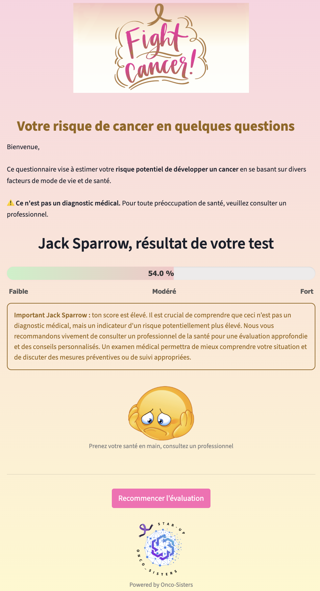

# fightCancer_app_streamlit

An interactive **Streamlit application** designed to assess the risk of developing cancer based on personal health data and lifestyle habits.

The model uses a **Random Forest classifier** trained with **SMOTE resampling** to correct class imbalance.

---

## Try the App via Streamlit Cloud

Click below to launch the app directly in your browser (no installation needed): 👉 
[](https://fightcancerappapp-mq3mhixvyhxr5jne567rt6.streamlit.app/)

https://fightcancerappapp-mq3mhixvyhxr5jne567rt6.streamlit.app/

---

## Features

- Interactive input of personal and lifestyle information  
- Risk score prediction using a pre-trained machine learning model  
- Risk displayed as a percentage (0%: low risk → 100%: very high risk)  
- Personalized health advice based on the predicted score  
- Clear, user-friendly results interface  

---

## Application Preview

### Input Form

<br/>


### Personalized Message Based on Risk Score



---

## Installation (optional)

1. Clone this repository:
```bash
git clone https://github.com/Dorothee-B/fightCancer_app_streamlit.git
cd fightCancer_app_streamlit
```

2. (Optional) Create and activate a virtual environment:
```bash
python -m venv venv
source venv/bin/activate   # macOS / Linux
venv\Scripts\activate      # Windows
````

3. Install the dependencies:
```bash
pip install -r requirements.txt
````

## 🚀 Deployment
This app is deployed on Streamlit Cloud and can be accessed at:
https://fightcancerappapp-mq3mhixvyhxr5jne567rt6.streamlit.app/

📂 Project Structure
```bash
fightCancer_app_streamlit/
│
├── Cancer_app_smote_resample_rf.py   # Main Streamlit script
├── model_cancer_resample_rf.pkl      # Pre-trained ML model
├── requirements.txt                  # Python dependencies
├── images/                           # Dossier des images (screenshots_app, logo, smiley)
│   ├── App_home_screenshot.png
│   ├── App_home_screenshot1.png
│   └── Result_app_screenshot.png
│   └── Logo_fight_cancer_app.png
├── data/                             # Dataset and feature importance report
└── README.en.md                      # This file
```

## Dataset
This application is based on the **HINTS 7 (2024)** (Health Information National Trends Survey) dataset, containing **77 questions** and conducted by the **National Cancer Institute (NCI)** in the United States.

- **Data collection period**: March – September 2024
- **Modes**: paper and web, with financial incentives ($2 + $10)
- **Sampling method**: 2-stage random sampling (address + one adult per household)
- **Initial sample size:** 7278 respondents
- **After data cleaning, filtering, resampling, the final modeling dataset was reduced to:**

  - **Training set:** 709 individuals
  - **Test set:** 178 individuals, including 87 high-risk cases

- **Goal**: to assess health behaviors, lifestyle, and access to medical information among U.S. adults
- **Built-in experiments**:
  - *Commitment to answer truthfully* to improve data quality
  - Additional $10 incentive in high-minority strata to improve representation
- **Official source**: https://hints.cancer.gov
- **License**: public data available for research and non-commercial use

## 🧠 Machine Learning Model

The prediction algorithm is based on a **Random Forest Classifier**, selected after automated comparison of several models using the **PyCaret** library.

---

## Modeling Process

- **Preprocessing:**
  - Data cleaning from the HINTS 7 survey
  - Encoding of categorical variables
  - Manually Resampling and Class balancing using **SMOTE** (Synthetic Minority Over-sampling Technique) is used to create synthetic samples of the minority class to balance the dataset and improve model performance.

- **Model comparison:**
  - Automated benchmarking via **PyCaret** with models such as Random Forest, Gradient Boosting, XGBoost, Logistic Regression, etc.
  - Evaluation metrics: **Accuracy**, **Recall**, **F1-score**, **AUC**, **MCC**

- **Final selection:**
  - **Random Forest** was chosen for its balance of **performance**, **robustness**, and **interpretability**
  - **Recall on the “high-risk” class** was prioritized due to the health-critical nature of the task

---
### Hyperparameters of the final Random Forest model

The model was fine-tuned using hyperparameter optimization. The best parameters found were:

- max_depth: 20  
- min_samples_leaf: 2  
- min_samples_split: 5  
- n_estimators: 200  

These settings helped improve model accuracy and robustness.


### 📈 Random Forest Model Results

| Class             | Precision | Recall | F1-score | Support |
|-------------------|-----------|--------|----------|---------|
| 0 (low risk)      | 0.76      | 0.68   | 0.72     | 87      |
| 1 (high risk)     | 0.72      | 0.79   | 0.75     | 90      |
| **Overall Accuracy** |         |        | **0.73** | 177     |

The model **maximizes recall for the "high-risk" class (0.79)** to avoid missing potentially serious cases.

- The trained model was saved and integrated into the app using `joblib`.

###  Cross-Validation (5-Fold)
To better assess the generalization performance of the model, a 5-fold cross-validation was performed using the final pipeline and selected hyperparameters.

| Metric        | Fold 1 | Fold 2 | Fold 3 | Fold 4 | Fold 5 | Mean      | Std. Dev |
| ------------- | ------ | ------ | ------ | ------ | ------ | --------- | -------- |
| **Accuracy**  | 0.695  | 0.723  | 0.712  | 0.761  | 0.670  | **0.712** | ±0.030   |
| **Precision** | 0.657  | 0.680  | 0.693  | 0.747  | 0.633  | **0.682** | ±0.039   |
| **Recall**    | 0.765  | 0.800  | 0.718  | 0.765  | 0.738  | **0.757** | ±0.028   |
| **F1-score**  | 0.707  | 0.735  | 0.705  | 0.756  | 0.681  | **0.717** | ±0.026   |


These scores confirm that the model performs consistently and reliably across different splits, especially in terms of recall for the high-risk class — which is the most important metric in this health-related context.

---

⚠️ This application does not provide a medical diagnosis. It is an estimation based on self-reported data. **For medical concerns, please consult a healthcare professional.**

---

## Authors  
- Aasiyah B.  
- Dorothée B.


## Contact

For any questions or suggestions, feel free to reach out:  
📧 Dorothée B. – busierdorothee@gmail.com  
📧 Aasiyah B.


## ❗ License

This project is protected by copyright.  
**Any use, reproduction, modification, or redistribution is strictly prohibited without prior written permission.**
