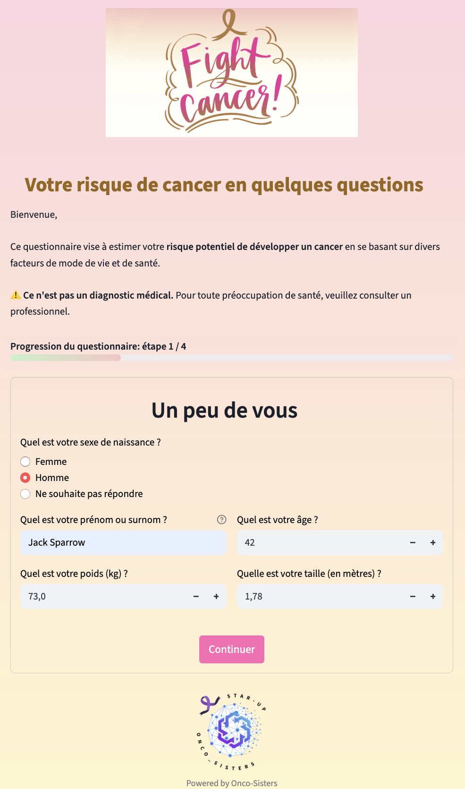
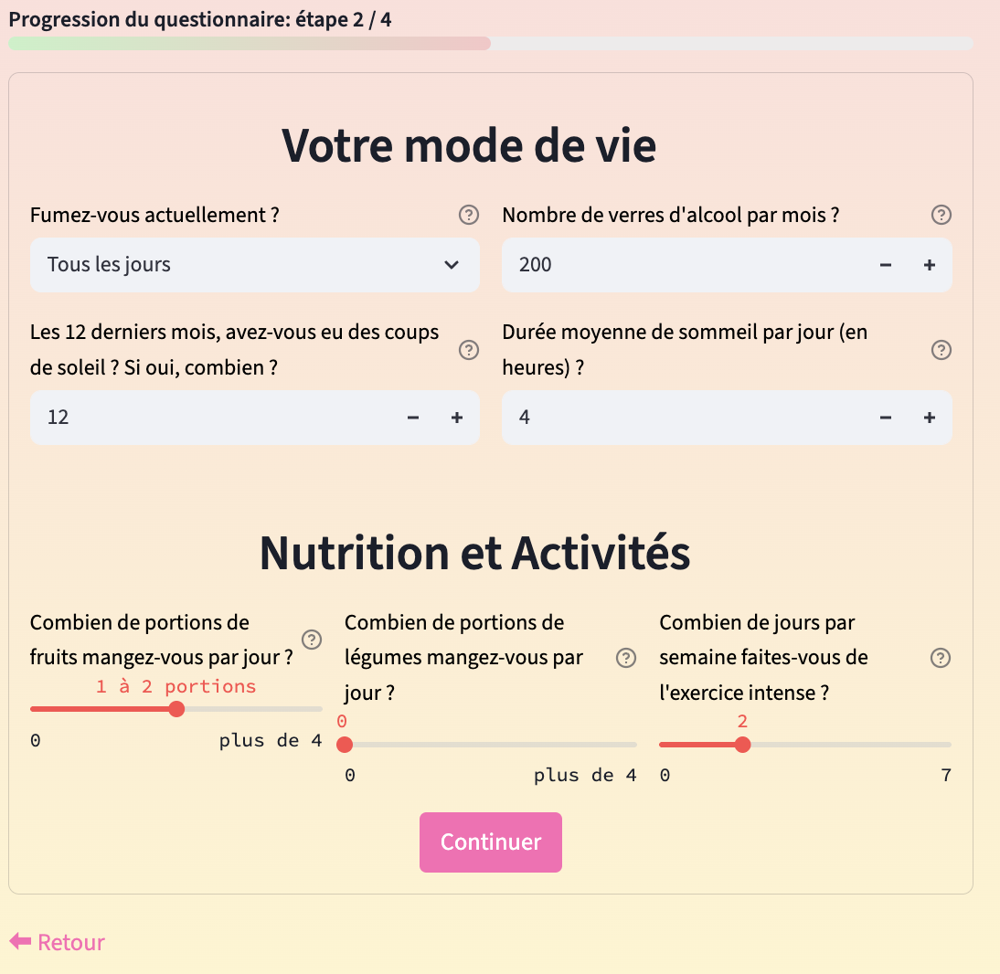

# fightCancer_app_streamlit

Une application **Streamlit interactive** permettant d’évaluer le **risque de développer un cancer** à partir des habitudes de vie et des données personnelles de santé. 

Le modèle utilise un classifieur **Random Forest**  entraîné avec un **réchantillonnage et correctif SMOTE** pour corriger le déséquilibrer des classes.

---

## Fonctionnalités

- Saisie interactive des informations personnelles et des habitudes de vie
- Prédiction du score de risque avec un modèle pré-entraîné
- Affichage d'un risque de développer un cancer sous forme de pourcentage (0% faible risque à 100% : risque très élevé)
- Message personnalisé selon le score
- Conseils santé adaptés selon le niveau de risque
- Interface claire et intuitive des résultats

---

## Aperçu de l'application

### Formulaire d’entrée

<br/>


### Message personnalisé selon le score


---

## Installation

1. Cloner ce dépôt :
```bash
git clone https://github.com/Dorothee-B/fightCancer_app_streamlit.git
cd fightCancer_app_streamlit
```

2. Créer un environnement virtuel (optionnel mais recommandé) :
```bash
python -m venv venv
source venv/bin/activate   # macOS / Linux
venv\Scripts\activate      # Windows
```

3. Installer les dépendances :
```bash
pip install -r requirements.txt
```

---

## 🚀  Déploiement 
L’application est déployée sur Streamlit Cloud et accessible à l’adresse :
https://fightcancerappapp-mq3mhixvyhxr5jne567rt6.streamlit.app/

---

##  📂 Structure du projet
```bash
fightCancer_app_streamlit/
│
├── Cancer_app_smote_resample_rf.py  # Script principal Streamlit
├── model_cancer_resample_rf.pkl      # Modèle ML pré-entraîné
├── requirements.txt            # Dépendances Python
├── images/                     # Dossier des images (screenshots_app, logo, smiley)
│   ├── App_home_screenshot.png
│   ├── App_home_screenshot1.png
│   └── Result_app_screenshot.png
│   └── Logo_fight_cancer_app.png
├── data/                       # dataset, features_importance.txt
└── README.md                   # Ce fichier
```
---

## 📊 Jeu de données

Cette application repose sur les données de l’enquête **HINTS 7 (2024)** (*Health Information National Trends Survey*), composé de 77 questions et réalisée par le **National Cancer Institute (NCI)** aux États-Unis.

- **Période de collecte** : mars à septembre 2024
- **Modes de réponse** : papier et en ligne, avec incitations financières ($2 + $10)
- **Méthodologie** : échantillonnage aléatoire en deux étapes (adresse + individu)
- **Objectif** : mesurer les comportements de santé, les habitudes de vie, et l'accès à l'information médicale dans la population américaine adulte
- **Expériences intégrées** : 
  - Effet d’un *engagement de sincérité* sur la qualité des réponses
  - Incitation spécifique ($10) dans les zones à forte minorité pour améliorer la représentativité
- **Lien officiel** : [https://hints.cancer.gov](https://hints.cancer.gov)
- **Licence / Accès** : données publiques accessibles gratuitement pour usage non commercial


## 🧠 Modèle de Machine Learning
L’algorithme de prédiction repose sur un **Random Forest Classifier**, sélectionné après comparaison automatisée de plusieurs modèles avec la **librairie PyCaret**.

## Processus de modélisation 

- **Prétraitement :**
  - Nettoyage des données issues de l’enquête HINTS 7
  - Encodage des variables catégorielles
  - Rééquilibrage des classes avec **SMOTE** (Synthetic Minority Over-sampling Technique)

- **Comparaison des modèles :**
  - Utilisation de **PyCaret** pour tester plusieurs algorithmes : Random Forest, Gradient Boosting, XGBoost, Logistic Regression, etc.
  - Évaluation selon plusieurs métriques : **Accuracy**, **Recall**, **F1-score**, **AUC**, **MCC**

- **Sélection finale :**
  - Le modèle **Random Forest** a été retenu pour son bon compromis entre **performance**, **robustesse** et **interprétabilité**
  - Le **Recall pour la classe “à risque”** étant prioritaire dans cette problématique de santé, il a été utilisé comme critère principal


## 📈 Résultats du modèle Random Forest

| Classe         | Précision | Rappel | F1-score | Support |
|----------------|-----------|--------|----------|---------|
| 0 (faible risque) | 0.73      | 0.66   | 0.69     | 91      |
| 1 (haut risque)   | 0.68      | 0.75   | 0.71     | 87      |
| **Accuracy globale** |         |        | **0.70** | 178     |

Le modèle **maximise le rappel de la classe "à risque" (0.75)** pour ne pas rater de cas potentiellement graves.

- Le modèle a été sauvegardé et intégré dans l’application avec joblib.

## Pipeline d’entraînement
**Étapes principales :**

- Nettoyage et préparation des données
- Encodage des variables catégorielles
- Normalisation si nécessaire
- Application de la méthode SMOTE pour équilibrer les classes (faible risque / risque élevé)
- Entraînement du modèle Random Forest
- Sauvegarde avec joblib pour intégration dans l’application


⚠️ Cette application ne fournit pas un diagnostic médical mais une estimation basée sur des données déclaratives. Consultez un professionnel de santé pour tout avis médical.

---

## Auteurs 
- Aasiyah B.
- Dorothée B.

## Contacts
Pour toute question ou suggestion, n’hésitez pas à me contacter : 
- Dorothée B. - busierdorothee@gmail.com
- Aasiyah B.